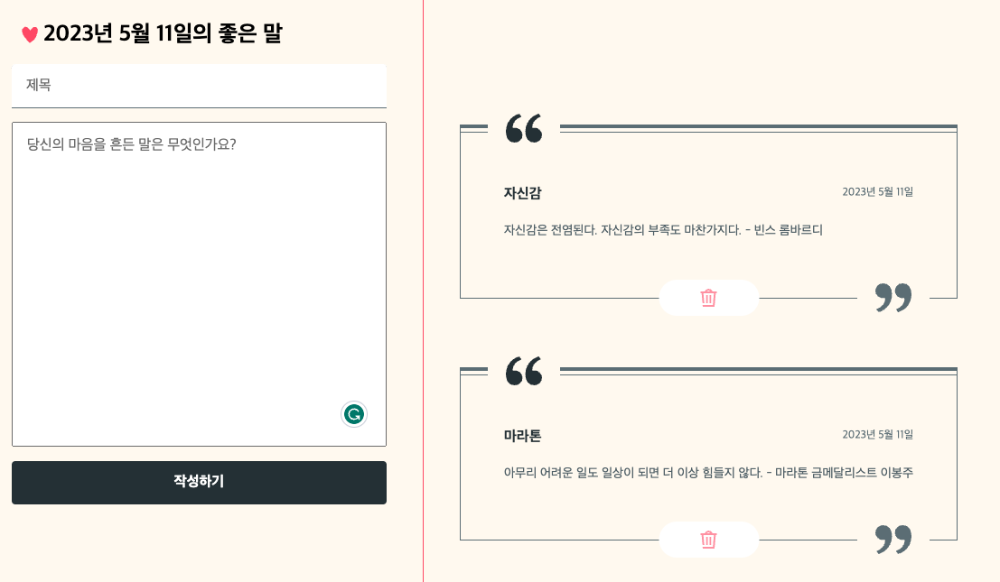

  

<h2 align="middle">명언 저장소</h2>
<h3 align="middle">HTML / CSS / JavaScript 활용 연습 Part00</h3>

DEMO : https://d-charlie-kim.github.io/Quotes_Storage/

  
  
  

## 🔥 Projects!

  

## 🎯 기능 요구사항
LocalStorage를 활용해서 메모장을 구현한다.

- [x] LocalStorage를 활용한다.
- [x] 저장된 메모를 보여준다.
- [x] 제목과 내용이 담긴 메모를 입력 받는다.
- [x] 저장된 메모를 삭제할 수 있어야 한다.

## 💟 기능 구현 목록

### ▶️ 기본 기능

- [x] 제목과 내용이 채워지지 않으면 저장할 수 없다.
- [x] 삭제 버튼을 누르면 메모가 삭제된다.
- [x] LocalStorage에 메모를 저장해서, 새로고침을 하여도 지워지지 않는다.
- [x] 최신순으로 메모를 정렬한다.
- [x] 화면을 줄이면 반응형 웹으로서 반응한다.
